# ☁️ AWS Serverless ETL Pipeline — Automated Data Cleaning & Analytics

> **A fully event-driven, serverless data pipeline on AWS that automatically ingests raw CSV data, removes duplicates and null values, catalogs the clean output, and makes it queryable through Amazon Athena — without any manual intervention after the initial upload.**

---

## 📌 What This Project Does

Raw data is rarely clean. This pipeline solves that by automating the entire journey from a messy CSV file to a structured, query-ready dataset. A single file upload to an S3 bucket sets the entire chain in motion — Lambda fires, Glue transforms, the output is catalogued, and the data is ready for analysis in Athena.

The project uses a restaurant sales dataset (`dirty_cafe_sales.csv`) as the working example, but the architecture is generic and applicable to any CSV-based data ingestion workflow.

---

## 🏗️ Pipeline Architecture

```
┌─────────────────────────────┐
│   S3: messy-data-input      │  ← Raw CSV uploaded here
│   dirty_cafe_sales.csv      │
└────────────┬────────────────┘
             │ S3 PutObject Event
             ▼
┌─────────────────────────────┐
│   AWS Lambda                │  ← Automatically triggered
│   function: data_cleaning   │     on every new upload
└────────────┬────────────────┘
             │ Starts Glue Job
             ▼
┌──────────────────────────────────────────────────────┐
│   AWS Glue Visual ETL — Job: data_cleaning           │
│                                                      │
│  [S3 Source] → [Drop Duplicates] → [Remove Nulls]   │
│                                        → [S3 Target] │
└─────────────────────────┬────────────────────────────┘
                          │ Writes clean output
                          ▼
┌─────────────────────────────┐
│   S3: data-output-clean     │  ← Transformed data lands here
└────────────┬────────────────┘
             │ Crawled by Glue Crawler
             ▼
┌─────────────────────────────┐
│   AWS Glue Data Catalog     │  ← Schema registered automatically
│   Database: resturant_db    │
│   Table: data_output_clean  │
└────────────┬────────────────┘
             │
             ▼
┌─────────────────────────────┐
│   Amazon Athena             │  ← SQL queries for visualization
└─────────────────────────────┘
```

---

## 🛠️ AWS Services Used

| Service | Purpose |
|---|---|
| **Amazon S3** | Three buckets — raw input, clean output, and Glue script storage |
| **AWS Glue Visual ETL** | No-code transformation job — deduplication and null removal |
| **AWS IAM** | Role granting Glue the permissions to access S3 and the Data Catalog |
| **AWS Lambda** | Event-driven trigger that starts the Glue job on every file upload |
| **Amazon CloudWatch** | Logs and execution monitoring for Lambda invocations |
| **AWS Glue Crawler** | Scans the output bucket and registers the table schema |
| **AWS Glue Data Catalog** | Metadata store — database and table definitions |
| **Amazon Athena** | Interactive SQL queries on the clean, catalogued data |

---

## 🔨 Build Walkthrough — Step by Step

---

### Step 1 — Create S3 Buckets

Three S3 buckets were created to keep each layer of the pipeline clearly separated.

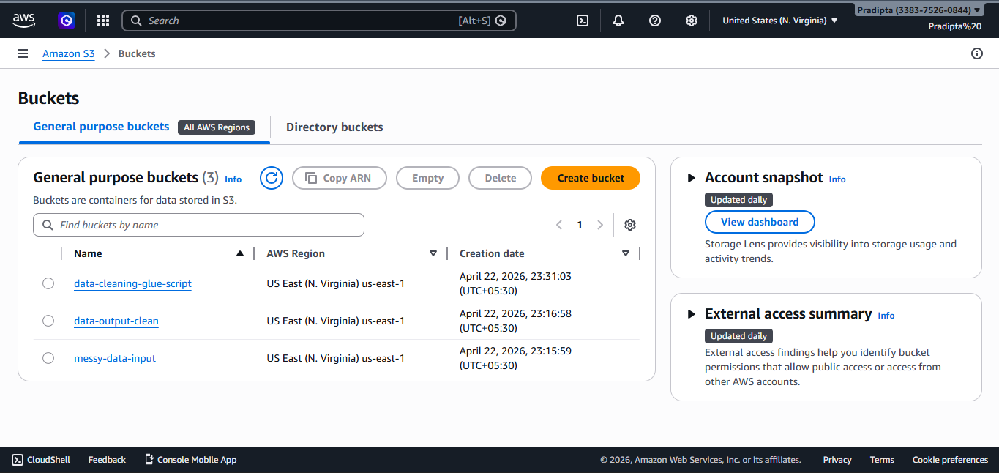

| Bucket | Role |
|---|---|
| `messy-data-input` | Landing zone for raw, unprocessed CSV files |
| `data-output-clean` | Destination for the transformed, clean output |
| `data-cleaning-glue-script` | Stores the auto-generated PySpark script from Glue Visual ETL |

Separating input and output buckets ensures the source data is never overwritten or contaminated by the transformation process. The script bucket keeps infrastructure artifacts isolated from data.

---

### Step 2 — Build the AWS Glue Visual ETL Job

The core transformation logic was built using **AWS Glue Visual ETL** — a canvas-based editor that constructs and manages a PySpark job under the hood. The job was named `data_cleaning`.

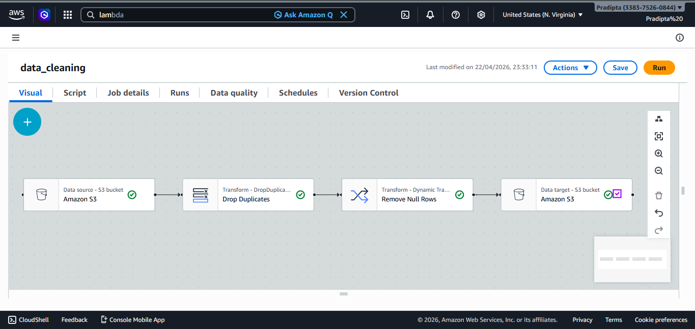

The job is composed of four connected nodes:

```
[Data source — Amazon S3]
        ↓
[Transform — Drop Duplicates]
        ↓
[Transform — Remove Null Rows]
        ↓
[Data target — Amazon S3]
```

- **Data source:** Reads from `s3://messy-data-input/`
- **Drop Duplicates:** Removes all exact duplicate rows across the entire dataset
- **Remove Null Rows (Dynamic Transform):** Filters out any row that contains a null or missing value in any column
- **Data target:** Writes the final clean dataset to `s3://data-output-clean/`

All four nodes are marked with green checkmarks, confirming they are correctly configured and connected. Glue automatically saves the generated PySpark script to the `data-cleaning-glue-script` bucket.

---

### Step 3 — Create an IAM Role for AWS Glue

An IAM role named `new` was created to give the Glue service the necessary permissions to operate across the pipeline.

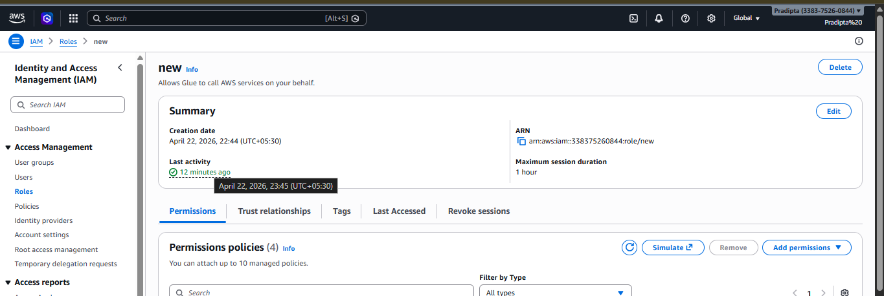

**Trust relationship:** `glue.amazonaws.com`  
**Permissions policies attached:** 4 policies covering S3 access, Glue service operations, and Data Catalog interactions.

This role is assigned directly to the Glue ETL job, allowing it to read from the input bucket, write to the output bucket, and interact with the Glue Data Catalog — all operating under Glue's identity.

---

### Step 4 — Create the Lambda Trigger Function

To make the pipeline respond automatically to new file uploads, an AWS Lambda function named `data_cleaning` was set up with an S3 event trigger.

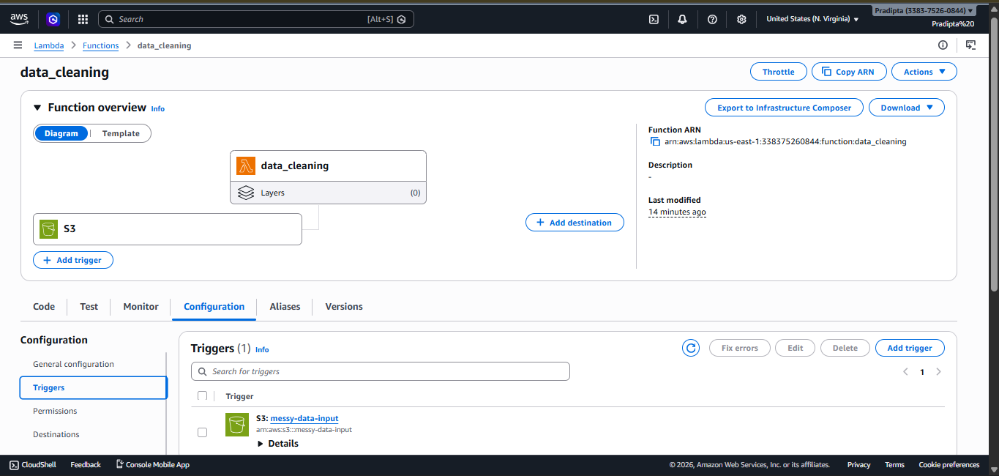


**Trigger:** S3 — `messy-data-input` bucket, `PUT*` events

Whenever a file is uploaded to `messy-data-input`, S3 fires an event to this Lambda function. The function receives the event and programmatically starts the `data_cleaning` Glue job using the AWS SDK. The configured trigger is visible in the Configuration panel under **Triggers (1)**, showing `S3: messy-data-input` with its full ARN.

---

### Step 5 — Upload the Raw Dataset to Trigger the Pipeline

With the complete pipeline in place, the raw file `dirty_cafe_sales.csv` (537.4 KB) was uploaded to the `messy-data-input` bucket to trigger and validate the full end-to-end flow.

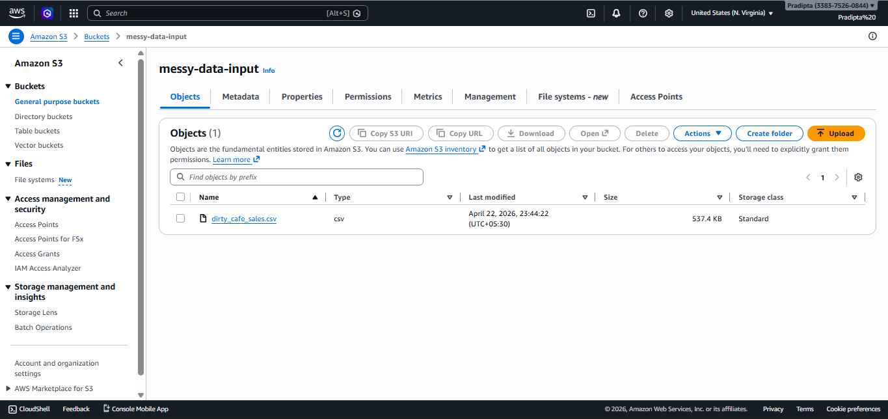

**File:** `dirty_cafe_sales.csv`  
**Size:** 537.4 KB  
**Storage class:** Standard

This upload was the live test of the entire system. The moment the file landed in the bucket, the `s3:ObjectCreated` event fired, Lambda was invoked, and the Glue ETL job was initiated — all automatically, with no further manual action taken.

---

### Step 6 — Monitor Lambda Execution in CloudWatch

Lambda's execution was verified through **Amazon CloudWatch Logs**, under the log group `/aws/lambda/data_cleaning`.

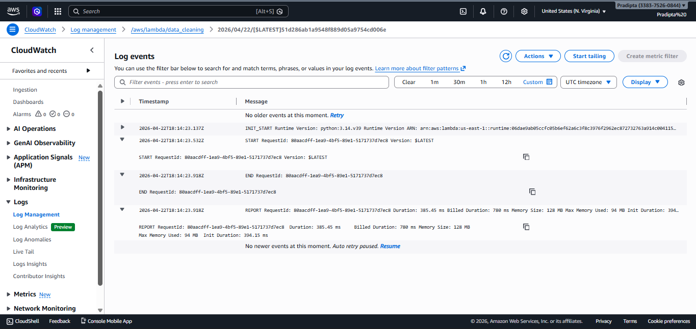

The log stream for the invocation records a clean, complete execution sequence:

- **INIT_START** — Runtime initialized successfully
- **START** — Function invocation began
- **END** — Function completed with no errors reported
- **REPORT** — Duration: 385.45 ms | Memory Size: 128 MB | Max Memory Used: 94 MB

The logs confirm the Lambda function received the S3 event, ran to completion without error, and successfully handed off execution to the Glue ETL job.

---

### Step 7 — Verify the Cleaned Output in S3

After the Glue ETL job completed, the `data-output-clean` bucket was inspected to confirm the output was written correctly.

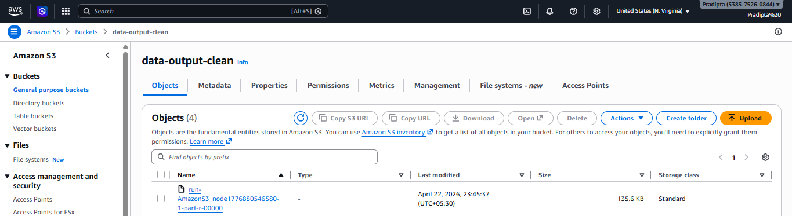

**Output file:** `run-AmazonS3_node1776880546580-1-part-r-00000`  
**Size:** 135.6 KB  
**Storage class:** Standard

The original input was 537.4 KB. The cleaned output is 135.6 KB — a reduction of approximately 75%. This confirms the Glue job successfully identified and removed a substantial volume of duplicate rows and null-laden records from the raw dataset.

---

### Step 8 — Configure a Glue Crawler on the Output Bucket

To make the cleaned data accessible through the Glue Data Catalog and queryable in Athena, a Glue Crawler was configured to scan the `data-output-clean` bucket and automatically infer its schema.

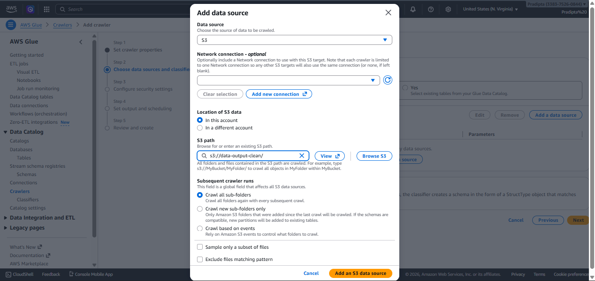

**Data source:** S3  
**S3 path:** `s3://data-output-clean/`  
**Location:** In this account  
**Crawl behavior:** Crawl all sub-folders

The crawler was configured to re-crawl all sub-folders on every run, ensuring that any future output files produced by the Glue job are also picked up and registered automatically.

---

### Step 9 — Run the Crawler

The crawler named `data_visualization` was run and completed successfully on the first attempt.

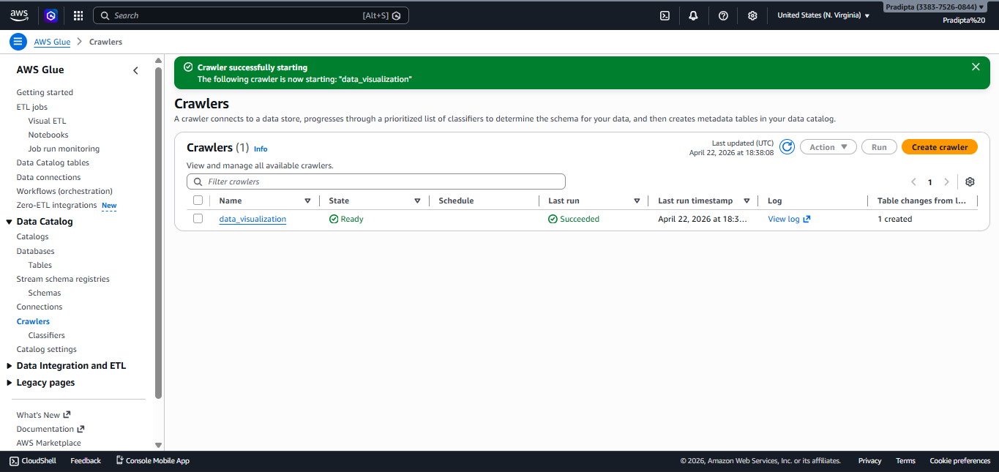

**Crawler name:** `data_visualization`  
**State:** Ready  
**Last run result:** Succeeded  
**Table changes from last run:** 1 created

The green **Succeeded** badge and the "1 created" entry under table changes confirm the crawler scanned the output bucket, detected the schema of the clean data, and registered a new table in the Glue Data Catalog.

---

### Step 10 — Glue Data Catalog — Database Registered

Following the crawler run, the Glue Data Catalog was verified to confirm the database and table were registered correctly.

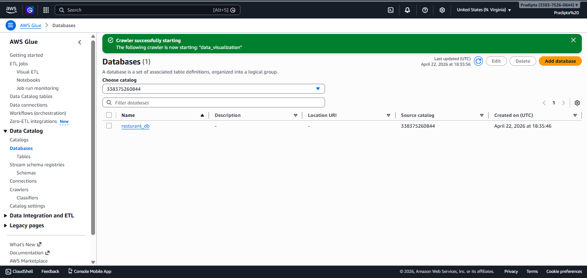

**Database name:** `resturant_db`

The `resturant_db` database now holds the table `data_output_clean`, which contains the full inferred schema of the cleaned output file. No manual table definition was written — the crawler derived and registered the entire schema automatically from the file's structure and content.

---

### Step 11 — Analyze the Data in Amazon Athena

With the schema registered in the Glue Data Catalog, Amazon Athena was used to run SQL queries directly against the cleaned dataset for visualization and insights.

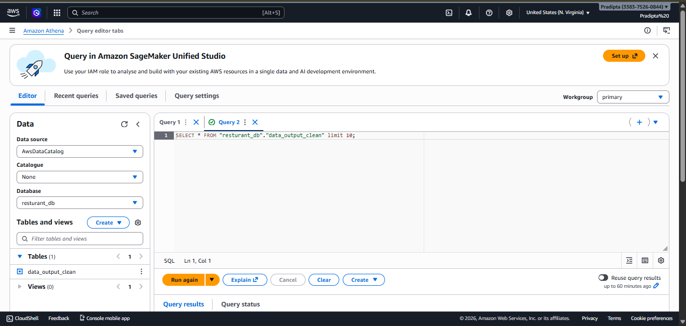

**Data source:** AwsDataCatalog  
**Database:** resturant_db  
**Table:** data_output_clean  
**Workgroup:** primary

The `data_output_clean` table is listed under `resturant_db` in the Athena editor's left panel. Queries were executed against the cleaned restaurant sales data to explore the dataset, validate column integrity, and extract meaningful insights for visualization. Athena reads directly from S3 using the metadata registered in the Glue Data Catalog — no additional data loading or separate warehousing required.

---

## 📊 Pipeline Results

| Metric | Value |
|---|---|
| Raw input file | `dirty_cafe_sales.csv` — 537.4 KB |
| Clean output file | `run-AmazonS3_node...` — 135.6 KB |
| Data reduction | ~75% (duplicates + nulls removed) |
| Lambda execution duration | 385.45 ms |
| Crawler tables created | 1 (`data_output_clean`) |
| Glue Data Catalog database | `resturant_db` |
| Query interface | Amazon Athena |

---


---

## 👤 Author

**Pradipta** — [@pradipta2005](https://github.com/pradipta2005)

---

*Built on AWS — S3 · Lambda · Glue · Athena · CloudWatch · IAM*
